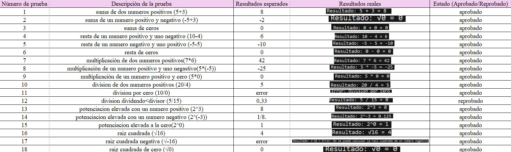

# Documentación - Máquina de Turing para Operaciones Matemáticas

## Descripción del Proyecto

Este proyecto implementa una máquina de Turing en Python capaz de realizar operaciones matemáticas básicas. La implementación está diseñada de manera simple y clara, separando las responsabilidades en diferentes clases.

## Arquitectura del Sistema

### Clases Principales

#### 1. Clase `Cinta` (cinta.py)
**Responsabilidad**: Manejar la cinta infinita de la máquina de Turing.

**Métodos principales**:
- `escribir(posicion, simbolo)`: Escribe un símbolo en una posición específica
- `leer(posicion)`: Lee el símbolo en una posición específica
- `limpiar()`: Limpia toda la cinta
- `mostrar_cinta(posicion_cabezera, rango)`: Muestra una representación visual de la cinta

**Características**:
- La cinta se implementa como una lista que puede crecer hacia ambos lados
- Posiciones no escritas se consideran espacios en blanco
- Permite visualización del estado actual

#### 2. Clase `Cabezera` (cabezera.py)
**Responsabilidad**: Controlar la cabeza de lectura/escritura.

**Métodos principales**:
- `leer()`: Lee el símbolo en la posición actual
- `escribir(simbolo)`: Escribe un símbolo en la posición actual
- `mover_izquierda()`: Mueve la cabezera una posición a la izquierda
- `mover_derecha()`: Mueve la cabezera una posición a la derecha
- `mover_a(posicion)`: Mueve la cabezera a una posición específica

**Características**:
- Mantiene la posición actual de la cabezera
- Proporciona interfaz para operaciones de lectura/escritura
- Permite visualización del estado actual

#### 3. Clase `MaquinaTuring` (maquina_turing.py)
**Responsabilidad**: Coordinar todos los componentes y ejecutar operaciones.

**Métodos principales**:
- `sumar(a, b)`: Realiza suma de dos números
- `restar(a, b)`: Realiza resta de dos números
- `multiplicar(a, b)`: Realiza multiplicación de dos números
- `dividir(a, b)`: Realiza división de dos números
- `potenciacion(base, exponente)`: Calcula potencia
- `raiz_cuadrada(numero)`: Calcula raíz cuadrada
- `mostrar_estado()`: Muestra el estado completo de la máquina
- `obtener_historial()`: Obtiene el historial de operaciones

**Características**:
- Integra cinta y cabezera
- Maneja estados de la máquina
- Mantiene historial de operaciones
- Proporciona interfaz unificada para todas las operaciones

## Operaciones Implementadas

### 1. Suma
- **Entrada**: Dos números enteros
- **Salida**: Suma de los números
- **Ejemplo**: `3 + 5 = 8`

### 2. Resta
- **Entrada**: Dos números enteros
- **Salida**: Diferencia de los números
- **Ejemplo**: `10 - 4 = 6`

### 3. Multiplicación
- **Entrada**: Dos números enteros
- **Salida**: Producto de los números
- **Ejemplo**: `7 * 6 = 42`

### 4. División
- **Entrada**: Dos números enteros (dividendo y divisor)
- **Salida**: Cociente entero o mensaje de error
- **Ejemplo**: `20 / 4 = 5`
- **Manejo de errores**: División por cero

### 5. Potenciación
- **Entrada**: Base y exponente (números enteros)
- **Salida**: Base elevada al exponente
- **Ejemplo**: `2^3 = 8`

### 6. Raíz Cuadrada
- **Entrada**: Un número entero
- **Salida**: Raíz cuadrada entera
- **Ejemplo**: `√16 = 4`
- **Manejo de errores**: Números negativos

## Flujo de Operación

1. **Inicialización**: Se crea una instancia de `MaquinaTuring`
2. **Preparación**: Se llama al método de la operación deseada
3. **Procesamiento**:
   - Se prepara la cinta con los números de entrada
   - Se ejecuta la operación matemática
   - Se escribe el resultado en la cinta
4. **Finalización**: Se actualiza el estado y se registra en el historial

## Estados de la Máquina

- **inicial**: Estado inicial, máquina lista para operar
- **preparado**: Cinta preparada con datos de entrada
- **completado**: Operación completada exitosamente
- **error**: Error durante la operación

## Casos de Prueba

### Casos Básicos
```
Suma: 3 + 5 = 8
      -5 + 3 = -2
      0 + 0 = 0
Resta: 10 - 4 = 6
      -5 - 5 = -10
      0 - 0 = 0
Multiplicación: 7 * 6 = 42
               5 * (-5) = -25
               5 * 0 = 0
División: 20 / 4 = 5
         10 / 0 = error
         5 / 15 = 0.33
Potenciación: 2^3 = 8
              2^(-3) = 0.125
              2^0 = 1  
Raíz cuadrada: √16 = 4
               √-16 = error
               √0 = 0   
```

### Casos de Error
```
División por cero: 10 / 0 = "Error: División por cero"
Raíz de negativo: √(-4) = "Error: No se puede calcular la raíz cuadrada de un número negativo"
```

### Casos Límite
```
División: 0 / 5 = 0
Potenciación: 5^0 = 1
Raíz cuadrada: √0 = 0
```

## Uso del Programa

### Modo Interactivo
```bash
python main.py
# Seleccionar opción 1 para modo interactivo
```

### Modo Ejemplos
```bash
python main.py
# Seleccionar opción 2 para ejecutar ejemplos
```

### Uso Programático
```python
from maquina_turing import MaquinaTuring

# Crear máquina
tm = MaquinaTuring()

# Realizar operaciones
resultado = tm.sumar(3, 5)
print(f"Resultado: {resultado}")

# Ver estado
print(tm.mostrar_estado())

# Ver historial
for operacion in tm.obtener_historial():
    print(operacion)
```

## Características Técnicas

### Ventajas del Diseño
- **Separación de responsabilidades**: Cada clase tiene una función específica
- **Simplicidad**: Código fácil de entender y mantener
- **Extensibilidad**: Fácil agregar nuevas operaciones
- **Visualización**: Permite ver el estado de la cinta y cabezera

### Limitaciones
- **Operaciones simples**: Solo operaciones matemáticas básicas
- **Números enteros**: No maneja números decimales
- **Implementación conceptual**: No es una máquina de Turing real con transiciones de estado

## Extensiones Posibles

1. **Nuevas operaciones**: Factorial, logaritmos, etc.
2. **Números decimales**: Soporte para números con decimales
3. **Transiciones de estado**: Implementar transiciones reales de máquina de Turing
4. **Interfaz gráfica**: Crear una interfaz visual
5. **Persistencia**: Guardar historial en archivo

## Conclusión

Este proyecto demuestra los conceptos fundamentales de una máquina de Turing de manera simple y educativa. La implementación separa claramente las responsabilidades y proporciona una base sólida para futuras extensiones.
